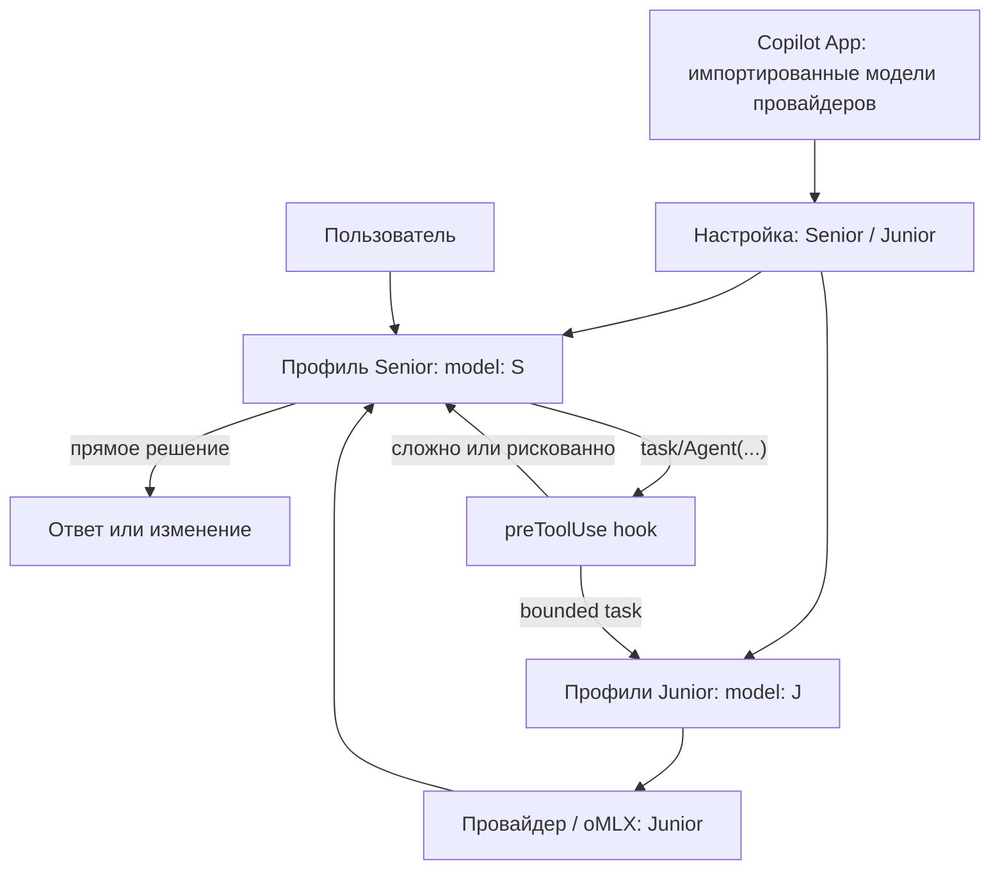

# Архитектура прототипа

## FPF-различения этой итерации

Рабочий вопрос: какую уже существующую в Copilot App импортированную модель назначить Senior, а какую Junior.

По [FPF](https://github.com/ailev/FPF/blob/main/FPF-Spec.md) это не создание моделей и не выбор Copilot `Auto`. Это назначение ролей (`U.SystemRoleAssignment`) поверх каталога уже импортированных моделей (OptionSet) с локальным замыканием: admissible ID — только те, что Copilot App уже показывает в picker после Settings → Model providers.

| Объект | Чем не является | Где живёт |
|---|---|---|
| Импортированная модель Copilot App | Роль, agent profile, oMLX-каталог сам по себе | Model picker / экспорт в `imported-models.json` |
| Senior / Junior | Отдельные модели plugin | `config/model-roles.json` |
| Agent profile | Источник каталога | `agents/*.agent.md` поле `model:` |
| Hook | Назначение модели сеанса | Меняет только selector уже созданного `task` |

Доказательство назначения — согласованность setting, agent frontmatter и физического ID в логе провайдера. Имя агента и UI недостаточны.

## Кто принимает какое решение

| Слой | Решение | Что не может сделать |
|---|---|---|
| Copilot App/session | Модель родительского хода | Не применяет наш plugin к встроенному `Auto` до запроса |
| Настройка plugin | Какая импортированная модель Senior, какая Junior | Не импортирует провайдера и не расширяет picker |
| Senior model | Вызвать ли `task` и сформировать subtask | Не гарантирует правильный model ID дочернего агента |
| `preToolUse` hook | Сохранить или заменить selector уже предложенного агента | Не может сам инициировать `task` и не выбирает model ID |
| Agent profile | Закрепить роль, tools и `model:` | Не гарантирует отсутствие Copilot fallback |
| oMLX / провайдер | Разрешить model ID, загрузить модель, выполнить inference | Не знает смысл задачи и custom-agent policy |

## Начальный алгоритм

Политика детерминирована и консервативна:

1. Security, auth, permissions, secrets, migration, architecture, public API, concurrency, integration/E2E, flaky tests и incidents остаются Senior.
2. `run/check` + unit test/lint/typecheck/build → Junior test runner.
3. `add/write` + unit test → Junior test writer, но только при явном bounded signal.
4. `find/search/inspect` + file/symbol/implementation → Junior explorer.
5. Всё неизвестное остаётся Senior.

Правила лежат в `plugins/local-model-router/config/router-policy.json` и включают английские и русские ключевые фразы.

Назначение физических моделей ортогонально этой policy: сначала выбираются роли из Copilot-imported каталога, затем routing решает, какой agent profile вызвать.

## Два режима hook

### Audit

Hook возвращает `{}` и ничего не меняет. В лог попадают структура аргументов, hash prompt и принятое rule-based решение. Содержимое prompt не сохраняется.

### Rewrite

Если поле selector известно и задача безопасно соответствует Junior-правилу, hook возвращает копию исходных аргументов в `modifiedArgs` как объект, меняя только selector. Для Claude/VS Code `PreToolUse` тот же объект кладётся в `hookSpecificOutput.updatedInput`. Если Senior уже предложил Junior для рискованной или нераспознанной задачи, hook возвращает deny с причиной.

Если selector не распознан, hook ничего не меняет. Это осознанный fail-open эксперимент; физическую модель всё равно необходимо проверить по oMLX.

## Почему один Junior одновременно

На 48 ГБ обе Q4-модели, KV cache, Metal buffers, Copilot App и macOS делят unified memory. Даже если веса помещаются, две параллельные генерации могут вызвать pressure, swap или eviction. Текущий plugin формулирует ограничение в роли, но ещё не предоставляет глобальный межпроцессный lock. До появления harness пользователь должен запускать один Junior за раз.
